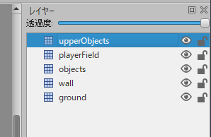
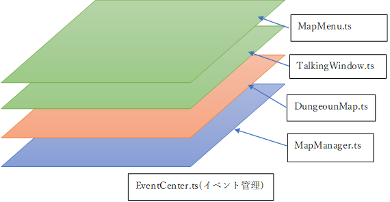

# Phaser 3 RPG template(仮) 仕様書
<details open>
<summary>参考リンク</summary>
  
  - [タイルマップの作り方](#タイルマップの作り方)
  - [Grid-engine リファレンス](https://annoraaq.github.io/grid-engine/typedoc/index.html)
  - [Phaser3 リファレンス](https://photonstorm.github.io/phaser3-docs/)
</details>

- [Phaser 3 RPG template(仮) 仕様書](#phaser-3-rpg-template仮-仕様書)
  - [タイルマップの作り方](#タイルマップの作り方)
    - [制約条件](#制約条件)
  - [基本構造](#基本構造)
    - [マップ画面](#マップ画面)
    - [戦闘画面](#戦闘画面)
    - [データベース](#データベース)
  - [使い方](#使い方)
    - [1. マップを作成する](#1-マップを作成する)
    - [2. NPCのセリフを追加する](#2-npcのセリフを追加する)
    - [3. ゲームUIを作成する](#3-ゲームuiを作成する)
  
## タイルマップの作り方

[大まかな流れ](https://medium.com/swlh/grid-based-movement-in-a-top-down-2d-rpg-with-phaser-3-e3a3486eb2fd)
### 制約条件

- "playerField"という名前のレイヤーをキャラクターレイヤーとする。

## 基本構造

### マップ画面

- MapManager.ts
  - マップを切り替えるときの情報を取得するクラス。将来的にBGMの制御をこのクラスで行う。裏で動いていて直接オブジェクトの描画などはしない。
- DungeonMap.ts
  - 情報を受け取ってゲームオブジェクトの描画、キャラクターの操作とかを行うクラス。各マップのNPC配置、敵の湧きポイントなどはこのクラスを継承した子クラスで行う。詳細:[マップの作り方](#マップの作り方)
- TalkingWindow.ts
  - NPCに話しかけたときに表示するポップアップウィンドウのクラス
- MapMenu.ts
  - マップで開くメニュー画面のクラス

### 戦闘画面
Work in progress.

### データベース

すべてのデータベースはTypeScriptのオブジェクトリテラルと辞書型オブジェクトで定義している。
- fileDB.ts
  - jsonとかタイル画像とかの場所を記載するデータベース
- dialogDB.ts
  - NPCのセリフを格納するデータベース
- commandDB.ts
  - キャラクターのコマンド情報を格納するデータベース
  
## 使い方
### 1. マップを作成する
- STEP 1: Tiled でマップを作って([詳細](#タイルマップの作り方))  
タイルマップ画像を以下に格納する  
  ```
  app/assets/img
  ```
- STEP 2: jsonを以下に格納する  
  ```
  app/assets/json
  ```
- STEP 3: データベースにファイルパスやIDを記載する  
データベースのファイルパス
  ```
  src/data/fileDB.ts
  ```  
  EX.  
  ```typescript
  export const fileDB: FileDBType = {
  //.....
  "exMap": {
          tilesetLocation:"assets/img/ex-dungeon-tileset.png",
          tileKey:"extile1",
          jsonKey:"ex-dungeon-map",
          jsonLocation:"assets/json/example_json.json",
          mapName:"Example Dungeon Map",
          settingID:"exMap",
          enemyAtlasLocation:"assets/img/example_enemy_atlas.json",
          enemySpriteKey:"example_enemies",
          enemySpriteLocation:"assets/img/example_enemy.png"
      },
  //.....
  }
  ```  
- STEP 4: DungeonMap.tsを継承したクラスを作成する 例のように関数をオーバーライドする  
  EX.  
  ```typescript
  export class ExampleDungeon extends DungeonMap{

    public override settingNPC(): void {
        
    }

    public override settingNPCMovement(): void {
        
    }

    public override mapTransition(): void {
        
    }

    public override spawnEnemy(): void {
        
    }

    public override settingEnemyMovement(): void {
        
    }
  }
  ```

- STEP 5: オーバーライドした関数の中身を実装してマップの設定を作る(詳細はリファレンスを...)  
  Ex.
  ```typescript
  export class ExampleDungeon extends DungeonMap{

    public override settingNPC(): void {
        super.pushCharacter('npc',7,{x: 12,y: 11})
        super.pushCharacter('npc2',5,{x: 15,y: 9})
    }

    public override settingNPCMovement(): void {
        super.setMovementType('npc',MovementType.RADIUS,1)
    }

    public override mapTransition(): void {
        super.setTransitionPoint({x: 14,y: 0},Direction.UP,'testMap',{x: 15,y: 21},Direction.UP,TestMap)
        super.setTransitionPoint({x: 14,y: 39},Direction.DOWN,'testMap',{x: 19,y: 9},Direction.DOWN,TestMap)
    }

    public override spawnEnemy(): void {
        super.pushEnemy('enemy1','enemy_42',{x: 15,y: 15})
        super.pushEnemy('enemy2','enemy_43',{x: 13,y: 15})
    }

    public override settingEnemyMovement(): void {
        super.setMovementType('enemy1',MovementType.RANDOM)
        super.setMovementType('enemy2',MovementType.RANDOM)
    }
  }
  ```
- STEP 6: マップを読み込むステップを実装する  
  遷移元のシーンで最初に読み込むマップを決める  
  Ex.     
  ```typescript
  this.scene.start('mapManager',{key:"exMap",pos:{x: 15,y: 21},dire:Direction.UP,scene:ExampleDungeon})
  ```

### 2. NPCのセリフを追加する

- STEP 1: ダイアログ(セリフ)のIDを決める  
  __IDの形式は 「マップのID_NPCのID」とする__ ※"_"(アンダーバー)を必ず含める  
- STEP 2: dialogDBにセリフを記載する  
  ファイルパスは以下  
  ```
  src/data/dialogDB.ts
  ```
  以下の例の形式でセリフを記載する。  
  ```typescript
  export const dialogDB = {
    //.....
    exMap_npc: [
        {type: 'dialog',text: "This is test.",charName: "TestBoy"},
        {type: 'dialog',text: "This is another test.\nThis is line 3.",charName: "TestBoy"},
        {type: 'timelineTransition', timelineID:'choice00'},
    ],
    choice00: [
        {type: 'dialog',text: "選択肢を表示します。"},
        {type: 'choice',choices: [
            {text: 'はい', timelineID: 'choice00_a01'},
            {text: 'いいえ', timelineID: 'choice00_a02'},
        ]}
    ],
    choice00_a01: [
        {type: 'dialog',text: "はい を選びました。"},
        {type: 'end'}
    ],
    choice00_a02: [
        {type: 'dialog',text: "いいえ を選びました。"},
        {type: 'end'}
    ],
  }
  ```
  type対照表  
  |  タイプ  |  内容  |
  | ---- | ---- |
  |  dialog  |  NPCが話すときのタイプ名  |
  |  end  |  話し終わるときのタイプ名  |
  |  choice  |  ダイアログで選択肢を表示する時のタイプ名  |
  |  timelineTransition  | timelineID: で指定したダイアログIDに遷移する時のタイプ名  |

- STEP 3: dialogDBに記載したNPCのidと同じidのNPCをマップに追加する  
  [詳細](#1-マップを作成する)

### 3. ゲームUIを作成する
